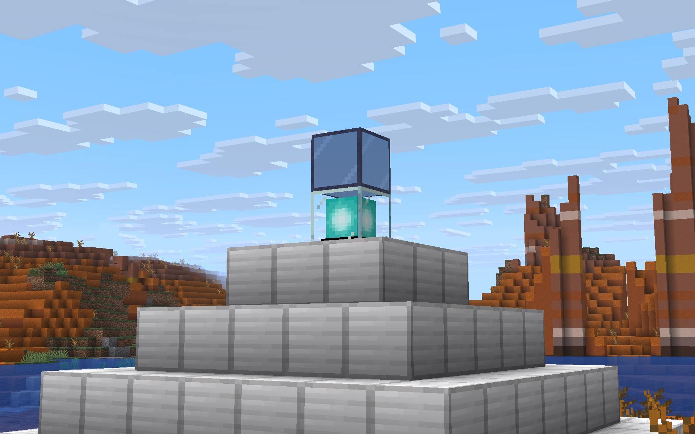

# Beacon Obscura

**Minecraft 26.1.2 - 26.2; Fabric and NeoForge.**

This small server-side-only mod lets you hide a beacon beam by placing tinted
glass above it, while keeping all the beacon's effects working normally.

Ideally, this mod would be obsoleted by Mojang adding this obvious and logical
feature to the stock game... it's frankly what we'd expect to happen if a block
of tinted glass was put in the beam's path.

## Installation

This is a **server-side mod** — it goes in the server's `mods/` folder only.
Players connect with a completely unmodified vanilla client.

### Fabric servers

Requires the correct [fabric-api jar](https://modrinth.com/mod/fabric-api) on
the server.

Copy `beacon-obscura-fabric-26.2.jar` to the server's `mods/` folder.

### NeoForge servers

Requires [NeoForge](https://neoforged.net/) on the server. No other mods needed.

Copy `beacon-obscura-neoforge-26.2.jar` to the server's `mods/` folder.

## Usage

Place one or more tinted glass blocks anywhere directly above the beacon block.
The beam will disappear. Remove them to show the beam again.

Everything else works exactly as normal — effects, the pyramid requirement,
and using sticky pistons to enable/disable the beacon.

## Single-player

If you drop the mod jar into a singleplayer client's `mods/` folder, it won't
do anything in normal singleplayer. However, if you use "Open to LAN", the mod
will kick in correctly for all connected players.

If the world is later moved to a server without the mod, or to _Realms_, or
back to plain singleplayer, tinted glass blocks will break the beacons again
as normal for vanilla.

## Compatibility

Tested on Minecraft 26.1.2 and 26.2 on Fabric. NeoForge support is included but
not yet tested.

Compatibility with other beacon-modifying mods is unknown. The change is very
small and only affects beacons that have tinted glass above them. It's not
expected to impact performance at all.

## How it works

Each tick, vanilla Minecraft's beacon mechanism works by scanning upwards from
beacon blocks looking for blocks, building a list of "beam sections", each with
_color_ and _height_, that are used to render the beam.

During that scan:

* If the block "dampens light" completely, the beam is broken and the beacon
  disabled.  Examples:  _dirt_, _stone_

* If the block doesn't "dampen light", the beam passes through.  Examples:
  _air_, _leaves_, _glass_, _stairs_, _trapdoors_

* If the block is a "`BeaconBeamBlock`", ie. _stained glass_, the first will
  change the beam's color to the block's dye color, and subsequent stained
  glass will mix the block's dye color and the current beam color.

* If the block is _bedrock_, it won't disable the beacon. This is a hardcoded
  exception to allow beacons to work in the Nether under the roof.

If the beam _is_ blocked, then the list of beam sections is wiped, so… no beam.

But, if nothing blocked the beam, then every 80 ticks (4 seconds) it checks if
there's a complete and correct pyramid of beacon base blocks immediately under
it, and if so, it'll give all players in range the primary and possibly
secondary beacon effects.  Another 80 ticks later, same thing happens again.

Now, that all seems fine, but unfortunately as far as this process is concerned,
_tinted glass_ is opaque as it "dampens light" completely.

**This mod patches that by overriding `getLightDampening` for _tinted glass_ 
to be transparent rather than opaque, but _only_ in the context of this beacon
beam checking process.**

Great... now tinted glass won't break the beam!  Big deal... we still have a
beam.

So, the trick is to _only make this change on the server-side_.

See, while most of the above process runs on both client and server, _the player
effects_ only run on the server.  And conversely, the rendering of the beam
only happens on the client.

(It's done that way so all players' gameplay effects are consistent, but
rendering can be done client-side to minimize network traffic.)

**In short, both client and server check for beacon activation, but effects are
server-side while rendering is client-side, so changing _tinted glass_ just on
the server enables the desired effect.**

## License and stuff

This mod is covered by the [MIT License](LICENSE.txt).

In short, you may freely use this mod in any modpack, but just don't claim you
made it. No promises, no warranties, so don't blame me if it breaks anything or
disadvantages you in some way, or you believe it did.

[Comments and improvements welcome.](https://github.com/tomgidden/minecraft-beacon-obscura)

-- `_gid`

